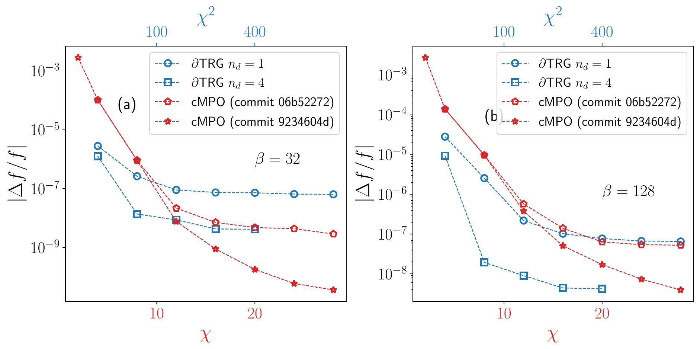

<div align="center">

<h2> Continuous Matrix Product Operator (cMPO) for Quantum Thermodynamics </h2>
</div>

[](https://travis-ci.com/github/TensorBFS/cMPO)

This is a PyTorch implementation of the cMPO approach to finite temperature quantum states. The cMPO approach is applicable to one-dimensional quantum systems with short-range or long-range interactions. This approach is described in the paper "Continuous Matrix Product Operator Approach to Finite Temperature Quantum States" ([arXiv link](https://arxiv.org/abs/2004.12928)).

## Features

- **Say NO to Trotter error:** thanks to the coutinuous-time formulation 
- **Simple yet generic:**  a unified interface to any Hamiltonian with an MPO representation

## Bonus 

- **Real-frequency local spectral functions:** analytic continuation is joyful, finally

## Example

```bash
python power_projection.py -bondD 10 -beta 10 -Gamma 1 -J 1 -resultdir isingdata
```

we calculate the thermodynamics of the transverse field Ising model 
$$
H=-J\sum_{\langle i,j\rangle} Z_i Z_j -\Gamma\sum_i X_i,
$$
with $J=1,\Gamma=1$ at temperature $\beta=10$ using cMPO-cMPS method with bond dimension $\chi=10$. The calculation results, including the free energy, internal energy, specific heat, and the local susceptibility, along with the checkpoint data files, are automatically saved in the directory `isingdata`.

- Before running the code, one needs to set the environment variable `OMP_NUM_THREADS`, namely the number of threads used by PyTorch.
- More models are defined in `model.py`, and one can investigate the thermodynamical properties of these models by modifying `power_projection.py` accordingly. To do this, in  `power_projection.py`, find the part `construct cMPO`

```python
    s = model.spin_half(dtype, device)
    ising = model.ising(Gamma=args.Gamma, J=args.J, dtype=dtype, device=device) # cmpo def
    T = ising.T
    W = ising.W
    ph_leg = ising.ph_leg
```

​		and simply replace `ising` by the model that you are interested in. You can also  easily simulate your own models by adding them to  `model.py`.

- To compute more quantities, like local observables and dynamical properties, you can use `postprocess.py` to access the checkpoint data files and calculate these quantities without running your simulation again.

## Update since publication

- commit `06b52272` (2020.04.29): original version published in the reference below 
- commit `9234604d` (2021.03.22) 
  - We avoid self iterations in power method, i.e., we *no longer* use the optimized cMPS in the previous power steps as the initialization for variational compression of the cMPS. Instead, the initialization for the variational compression is always generated by the iterative SVD update. This helps to jump out of local minima during the optimization process.
  - We stabilize the the iterative SVD update (also called MERA update) by adding line-search procedures.

## Benchmark

Benchmark with [dTRG](https://github.com/TensorBFS/dTRG) in transverse field Ising model is shown in the following figure. 

As one can see, after the improvement in  commit `9234604d`, the cMPO method shows the capability to jump out of local minima, and the results can be systematically improved by increasing the bond dimension $\chi$. At both temperatures $\beta=32$ and $\beta=128$, when bond dimensions are large, the accuracy of cMPO method is not inferior to that of dTRG.

<div align="center">

</div>


## To cite

```latex
@article{PhysRevLett.125.170604,
  title = {Continuous Matrix Product Operator Approach to Finite Temperature Quantum States},
  author = {Tang, Wei and Tu, Hong-Hao and Wang, Lei},
  journal = {Phys. Rev. Lett.},
  volume = {125},
  issue = {17},
  pages = {170604},
  numpages = {7},
  year = {2020},
  month = {Oct},
  publisher = {American Physical Society},
  doi = {10.1103/PhysRevLett.125.170604},
  url = {https://link.aps.org/doi/10.1103/PhysRevLett.125.170604}
}
```

